# AviationExam Application 

# DeployedLink: [https://aviatorexam.in/]

## Introduction

Welcome to the AviationExam application, a comprehensive tool developed by Aviator Cloud to assess and enhance the aptitude of aspiring pilots. This application integrates a series of innovative tests designed to evaluate critical skills necessary for success in flight training and a future career as a pilot.

## Purpose of the Application

The AviationExam application aims to provide a thorough evaluation of candidates, offering insights into their innate abilities crucial for aviation. The tests included in this application cover various aspects, including spatial awareness, multitasking, short-term memory, and advanced flight control. Each test is meticulously crafted to simulate real-world scenarios, ensuring a reliable assessment of a candidate's potential as a pilot.

## Test Modules

### 1. Short-Term Memory Test
Assess and enhance your memory skills vital for quick information absorption, retention, and recall. Real-world aviation scenarios challenge candidates to demonstrate their ability to handle dynamic and fast-paced situations.

(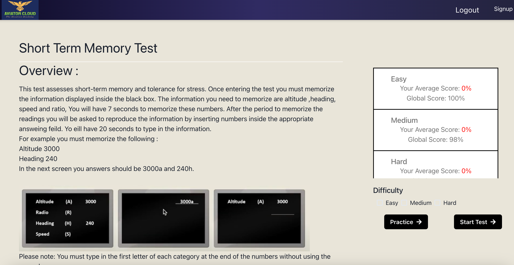</img>)

(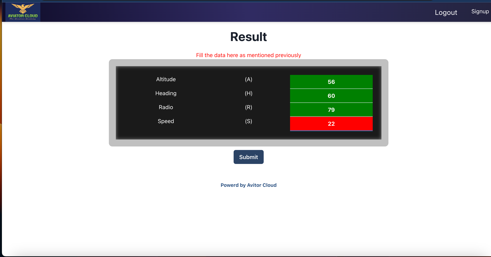</img>)

### 2. Spatial Awareness Test
Evaluate your understanding of three-dimensional spaces, a fundamental skill for navigating flight paths, interpreting charts, and maintaining awareness of aircraft positions in relation to other objects.

(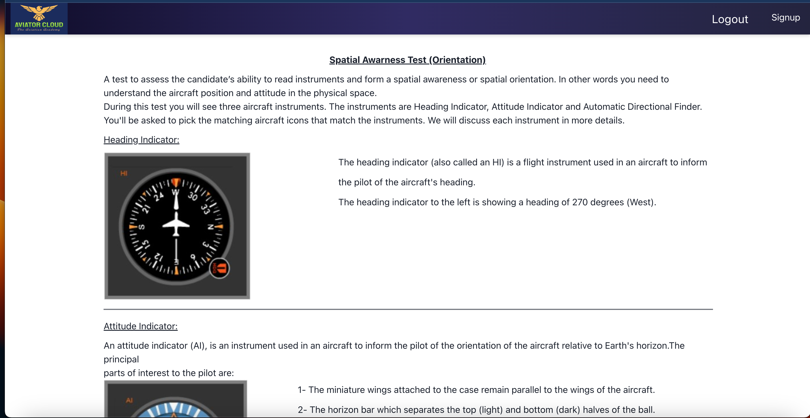</img>)

(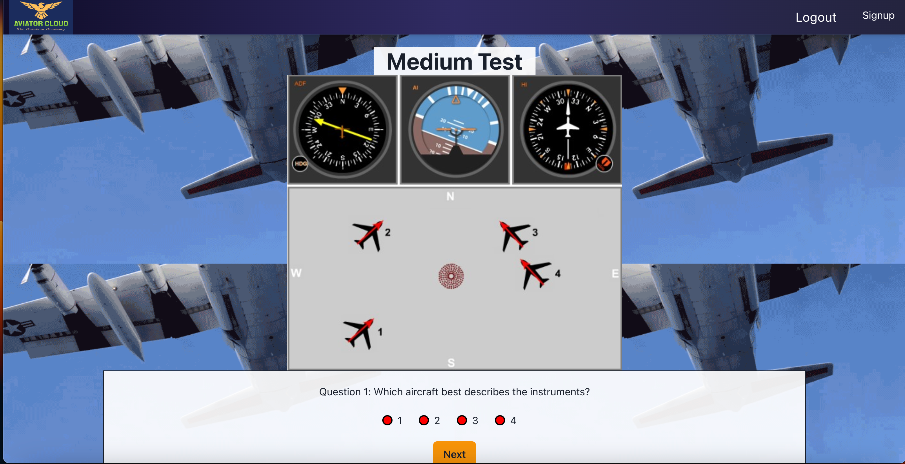</img>)

### 3. Multi-Tasking Test
Test your ability to manage multiple tasks simultaneously, a crucial skill for pilots. Simulated flight scenarios replicate the demands of a cockpit environment, assessing how well candidates can handle diverse responsibilities.

(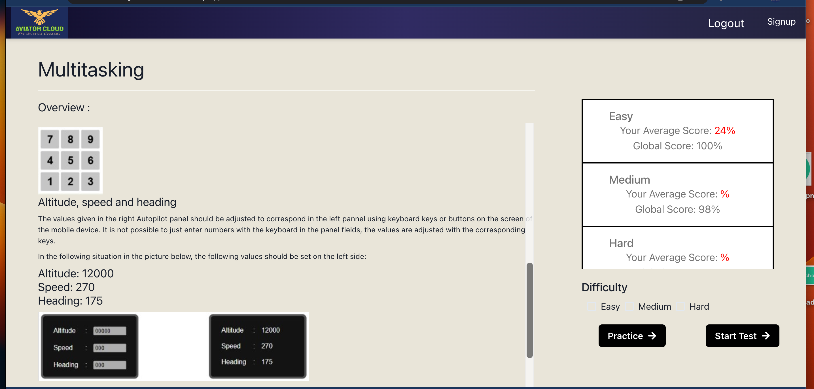</img>)

(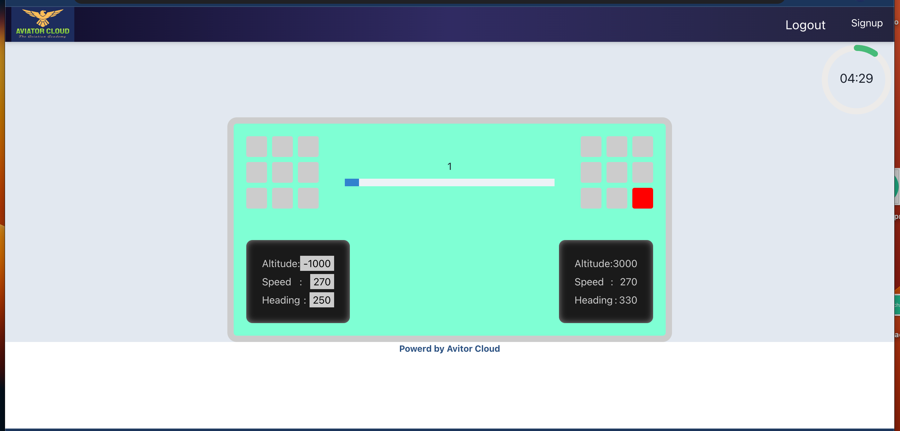</img>)

### 4. Advanced Flight Control Test
Evaluate your proficiency in flight control, from basic operations to complex maneuvers, under various atmospheric conditions. High-fidelity simulations mirror real-world flight situations to gauge your readiness for pilot training.

(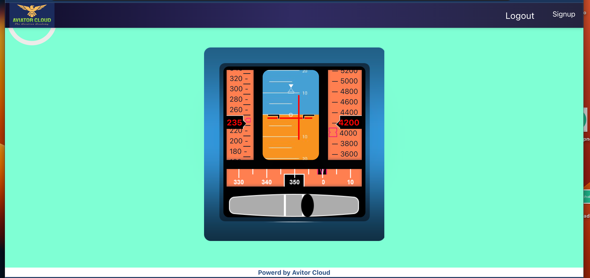</img>)

(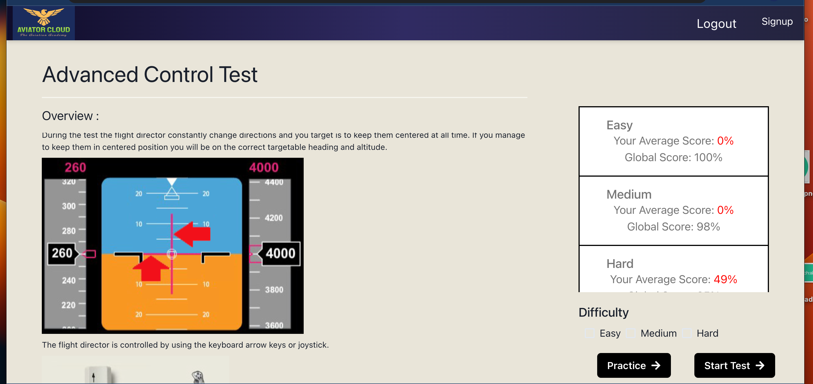</img>)

### 5. Normal Flight Control with Multi-Tasking Test
Integrate the assessment of basic flight control skills with multitasking capabilities, providing a comprehensive evaluation of the intertwined skills required for piloting an aircraft.

(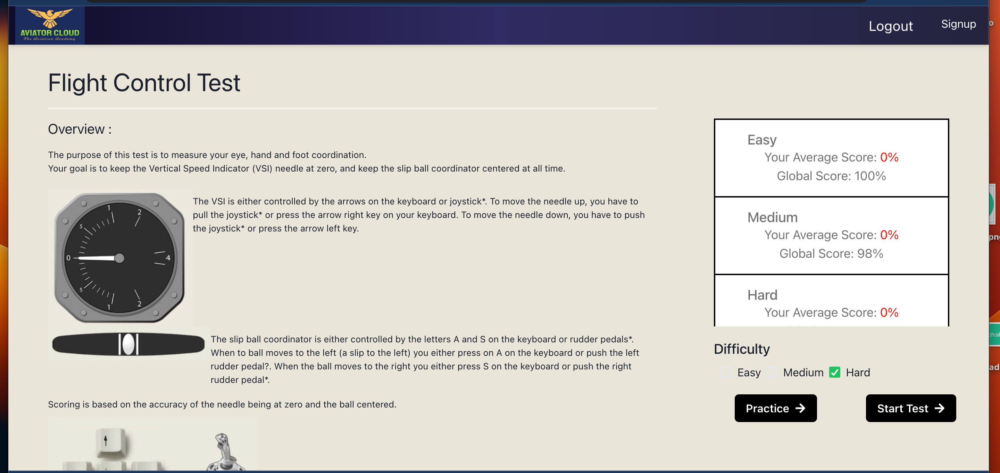</img>)

(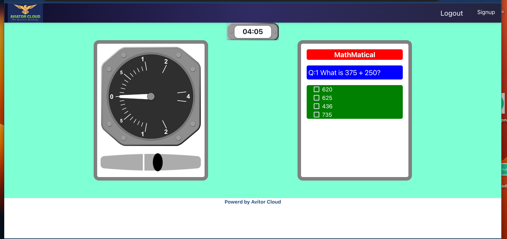</img>)

### 6. Advanced Flight Control with Multi-Tasking Test
Combine the evaluation of advanced flight control skills with the ability to effectively multitask. High-stress scenarios mirror real-world flight conditions, offering practical insights into a candidate's readiness for a challenging aviation career.

(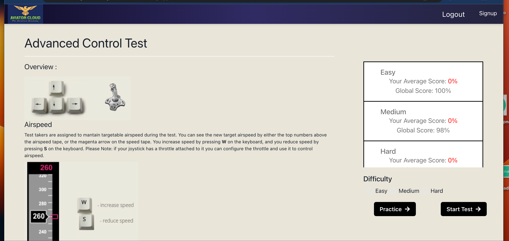</img>)

(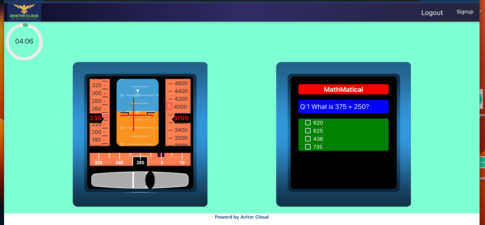</img>)

## How to Use the Application

1. **Accessing the Tests**: Each test module is accessible through the application's user-friendly interface.

2. **Test Instructions**: Read and follow the instructions for each test carefully. The simulations and scenarios are designed to replicate real aviation challenges.

3. **Performance Evaluation**: Receive detailed feedback on your performance, identifying strengths and areas for improvement. The application provides a holistic view of your aptitude for a career as a pilot.

## Conclusion

The AviationExam application by Aviator Cloud is a powerful tool for aspiring pilots, offering a comprehensive evaluation of essential skills required for success in the aviation industry. Embark on your journey towards becoming a skilled and capable pilot by utilizing this innovative application.

*Powered by Aviator Cloud Developed by Guddu Tiwari*
